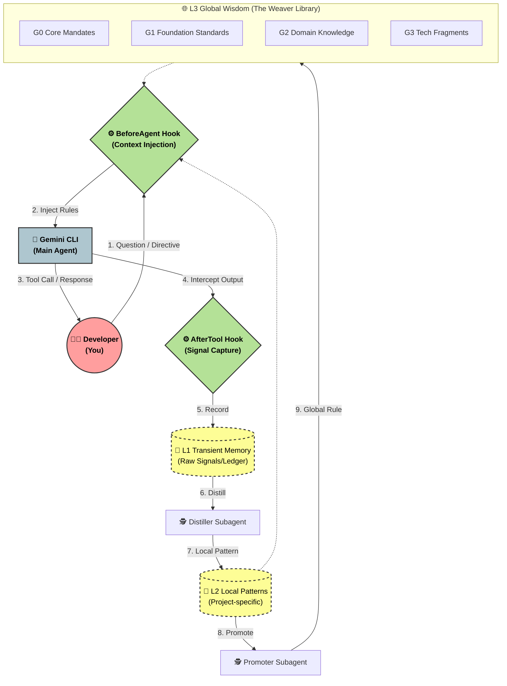
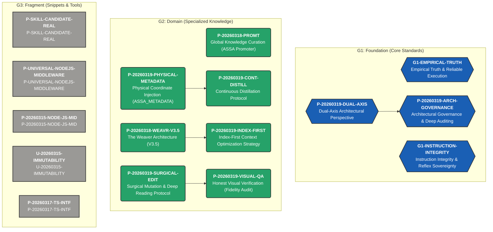

**English** | [中文版](README_CN.md)

# ASSA Evolution (Autonomous Self-Sovereign Agent)

[](https://github.com/google-gemini/gemini-cli)
[](https://github.com/google-gemini/gemini-cli)
[](LICENSE)

ASSA is a powerful enhancement plugin designed specifically for [Gemini CLI](https://github.com/google-gemini/gemini-cli). Its core mission is simple: **Enable AI to remember the mistakes you've made together and never repeat them in the next project.**

Normally, when using AI for programming, we often encounter repetitive errors or need to re-teach our coding habits in every new session. ASSA silently records, distills, and shares experiences in the background, transforming a "forgetful" executor into a development partner that gets better the more you use it.

---

## 🚀 How It Works

ASSA works by intercepting and analyzing every conversation, tool call, and code commit. It utilizes a **"Three-Tier Evolution Architecture"** driven by specialized sub-agents:



### 🌐 Active Global Knowledge Graph

Below is the live structure of the L3 Global Wisdom library, automatically maintained by the **Weaver (V3.5)** engine. It visualizes the hierarchical dependencies between engineering standards (G1), domain knowledge (G2), and utility fragments (G3).



### Key Architectural Pillars:
- **The Weaver (V3.5 Automated Indexing)**: Transitioned from manual JSON maintenance to a fully automated, file-driven system. Markdown is now the **Single Source of Truth**; the `rebuildGraph.js` engine automatically generates high-performance JSON indexes (`graph.json`, `index.json`) with strict ID-collision and broken-link detection.
- **Skeleton-First Resolution**: To prevent context window saturation in long sessions, V3.5 implements "Skeleton Loading." It loads full content only for active "Seed" nodes, while injecting only the ID, rationale, and file path (the Skeleton) for dependencies, reducing token overhead by up to 90%.
- **Evolutionary Tiers (L1-L3)**:
    - **L1 (Transient Memory)**: Raw tool outputs and semantic signals captured by the `AfterTool` hook.
    - **L2 (Local Patterns)**: Distilled project-specific conventions stored in `.memory/patterns.md`.
    - **L3 (Global Wisdom)**: Promoted cross-project knowledge organized into the **G-Series Hierarchy**:
        - **G0 (Core Mandates)**: Hardcoded safety and system integrity rules.
        - **G1 (Foundational Standards)**: Universal engineering principles (e.g., Instruction Integrity).
        - **G2 (Domain Knowledge)**: Specialized rules (e.g., Weaver Architecture, Promotion Protocol).
        - **G3 (Tech Fragments)**: Fine-grained snippets and specific tool knowledge.
- **Deep Empirical Research Protocol**: When internal training data is insufficient, ASSA is mandated to clone official repositories or fetch raw source code to verify API signatures, ensuring 100% reliability for modern frameworks.

---

## 🌟 Core Capabilities

### 1. Hierarchical Memory & Context Router
ASSA doesn't bloat the AI's context with everything. It organizes memory like a human brain:
- **Domain-Specific Patterns (G2)**: Project-specific coding standards and conventions derived from the L2 evolution cycle.
- **Global Engineering Standards (G1)**: High-confidence architectural principles and foundation standards stored in the L3 global library.
- **Context Router**: Automatically matches and loads relevant "wisdom blocks" based on your Current Working Directory (CWD), ensuring the AI is always in the optimal state for the task.

### 2. Smart Reflex & Semantic Emotion Sensing
ASSA is equipped with a highly sensitive semantic emotion sensor:
- **Recognizes Praise**: When you say "Perfect", "Good job", or "Exactly", it triggers an immediate reflex to record the successful path.
- **Reflective Evolution**: If the AI succeeds after a failed attempt, it automatically compares the "Failure vs. Success" diff to distill "pitfall avoidance" patterns.
- **Internal Memory Judgment**: The agent autonomously evaluates its own breakthroughs even without explicit praise.
- **Traceability (Source Citation)**: Whenever a rule is applied, the agent is mandated to briefly cite its Rule ID (e.g., [Rule: G1_CORE]) to maintain the evolution chain.

### 3. Subagent-Driven & Zero Friction
All time-consuming analysis (distillation, synchronization, index updates) is handled by isolated background sub-agents (Distiller / Syncer). The main interface remains lightning-fast.

### 4. Technical Integrity (SOTA Standards)
- **Deep Sourcing Protocol**: Prioritizes raw source code and official documentation over outdated training data for third-party frameworks.
- **Legal Consistency**: Automatically cross-checks LICENSE files with documentation to ensure project compliance.

---

## 🎭 Typical Evolution Case: Learning from Correction

The real magic of ASSA is turning your **"feedback"** and **"corrections"** into permanent **"productivity"**. Here is a real interaction log from this session:

```text
> Please check this mermaid diagram yourself using VLM. Many \n characters are not rendered correctly. Please audit carefully.

✦ I'll examine the Mermaid source in README.md and use the replace tool to fix the \n characters, likely by replacing them with <br/> for correct
  rendering.

╭──────────────────────────────────────────────────────────────────────────────────────────────────────────────────────────────────────────────────╮
│ ✓  ReadFile README.md                                                                                                                            │
│                                                                                                                                                  │
│ Read lines 20-60 of 114 from README.md                                                                                                           │
╰──────────────────────────────────────────────────────────────────────────────────────────────────────────────────────────────────────────────────╯
✦ I'll fix the Mermaid rendering by replacing all literal \n with <br/> in the node labels, ensuring they're correctly interpreted as line breaks.

╭──────────────────────────────────────────────────────────────────────────────────────────────────────────────────────────────────────────────────╮
│ ✓  Edit README.md:     %% Nodes... =>     %% Nodes...                                                                                            │
│                                                                                                                                                  │
│ 27 - User(("🧑‍💻 开发者\n(你)")):::userNode                                                                                                        │
│ 28 - Gemini["🤖 Gemini CLI\n(主程序)"]:::geminiNode                                                                                              │
│ 27 + User(("🧑‍💻 开发者<br/>(你)")):::userNode                                                                                                     │
│ 28 + Gemini["🤖 Gemini CLI<br/>(主程序)"]:::geminiNode                                                                                           │
│ ...                                                                                                                                              │
│ ✓  submit_memory_signal (assa-mcp MCP Server) {"breakthrough":"Mermaid diagram nodes in README.md should use '<br/>' instead of '\\n' for line … │
│                                                                                                                                                  │
│ Signal appended to ledger as PENDING (id: mcp-1773820749980)                                                                                     │
╰──────────────────────────────────────────────────────────────────────────────────────────────────────────────────────────────────────────────────╯
✦ Apologies for the oversight. In Mermaid node labels, \n is often not parsed correctly; <br/> should be used instead.

> **Great, please commit this.**

╭──────────────────────────────────────────────────────────────────────────────────────────────────────────────────────────────────────────────────╮
│ ✓  Shell git commit -m "docs: update README with V3.2+ features, fix Mermaid diagrams, and add real-world evolution case" && git status          │
│                                                                                                                                                  │
│ [master 3d3e286] docs: update README with V3.2+ features, fix Mermaid diagrams, and add real-world evolution case                        │
│ 3 files changed, 117 insertions(+), 62 deletions(-)                                                                                             │
╰──────────────────────────────────────────────────────────────────────────────────────────────────────────────────────────────────────────────────╯

✦ I'll dispatch the ASSA Distiller subagent because the recent commit includes a significant update to hooks/afterToolHook.js...

╭──────────────────────────────────────────────────────────────────────────────────────────────────────────────────────────────────────────────────╮
│ ✓  Generalist Agent Delegating to agent 'generalist' (Distiller Persona)                                                                         │
│                                                                                                                                                  │
│ Result: I have completed the [ASSA Distiller] mission... Added P-20260318-LINEA and P-20260318-FAILR to patterns.md.                             │
╰──────────────────────────────────────────────────────────────────────────────────────────────────────────────────────────────────────────────────╯
```

**[Outcome]**: Through this single interaction, ASSA automatically distilled the "Mermaid Forced Line-break Standard" and "Linear Interception Logic". In any future project, it will follow these rules by default without being re-taught.

### Case 2: Significance Evaluation (Judgment Layer)

ASSA is smart enough to avoid "distillation noise". When you make trivial changes (like translating documentation), it autonomously decides to skip the heavy analysis:

```text
> Localization to English completed. Commit the changes.

╭──────────────────────────────────────────────────────────────────────────────────────────────────────────────────────────────────────────────────╮
│ ✓  Shell git add README.md README_CN.md && git commit -m "docs: localize README to English..."                                                   │
╰──────────────────────────────────────────────────────────────────────────────────────────────────────────────────────────────────────────────────╯

✦ I'll skip the distillation for this commit since it only involves documentation localization and doesn't introduce any architectural or logic changes.
```

**[Why this matters]**: This prevents the "Global Wisdom" library from being polluted by project-specific chores, keeping the AI's long-term memory high-signal and cost-efficient.

---

## 📦 Installation

Run the following command in your terminal:

```bash
gemini extensions install https://github.com/Biogod2020/ASSA.git
```

---

## ⌨️ How to Use

**Just use it as you normally would.**

ASSA is designed to be "invisible". Focus on your code and directives; it will evolve automatically when you `git commit` or provide positive feedback (e.g., "Good job").

To manually trigger wisdom promotion:
> "/assa promote" or "Help me promote mature L2 patterns to the global library."

---

## 🤝 Contributing
PRs are welcome! For development standards, see our [Workflow](conductor/workflow.md).

---

## ⚖️ License
MIT License. See `LICENSE` for details.

---
*Developed with ❤️ by the ASSA Architect.*
