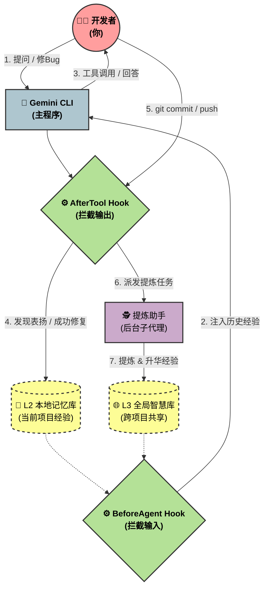

# ASSA Evolution (自动进化代理)

[](https://github.com/google-gemini/gemini-cli)
[](https://github.com/google-gemini/gemini-cli)
[](LICENSE)

ASSA 是专为 [Gemini CLI](https://github.com/google-gemini/gemini-cli) 编写的一个增强插件。它的核心目标很简单：**让 AI 记住你们一起踩过的坑，并在下一个项目中不再犯同样的错。**

平时我们使用 AI 编程时，经常会遇到它反复犯同样的错误，或者每次新开一个对话都需要重新教它你的代码习惯。ASSA 通过在后台悄悄记录、提炼和共享经验，把一个“健忘”的执行者，变成一个会越用越顺手的开发伙伴。

---

## 🚀 它是如何工作的？

ASSA 的核心在于拦截并分析每一次对话、每一次工具调用和代码提交。以下是它的标准工作流：



当你启动 Gemini CLI 并加载 ASSA 时，你会看到类似这样的后台静默工作日志：

```log
[ASSA Hook] BeforeAgent Hook Fired
[ASSA Hook] Domain match detected: Loading typescript_interface_priority.md
[ASSA Hook] Injecting 2 local patterns into context.

... (你与 AI 正常交流) ...

[ASSA Hook] AfterTool Hook fired
[ASSA Trigger] VICTORY DETECTED: A previously failing tool has now succeeded.
[ASSA Action] Calling tool 'submit_memory_signal' to save the success pattern...

... (你提交了代码) ...

[ASSA Trigger] GIT COMMIT DETECTED
[ASSA Action] Significance Evaluation: High. Dispatching 'distiller' subagent...
[ASSA Subagent] Distilled 2 signals into patterns.md and marked as PROCESSED.
```

---

## 🌟 核心能力

### 1. 记忆分级管理 (Hierarchical Memory)
ASSA 不会把所有的聊天记录都塞给 AI（那会导致 Token 爆炸和反应变慢）。它像人脑一样整理记忆：
- **临时记录 (L1)**：在当前对话中，抓取你纠正它的点或者你表扬它的地方。
- **项目经验 (L2)**：自动把这些记录提炼成当前项目的代码规范（比如“这个项目里强制使用 TypeScript”），存在 `.memory/patterns.md` 里。
- **全局库 (L3)**：当你完成一个里程碑或者 push 代码时，它会挑出那些具有通用价值的架构经验，自动同步到全局配置目录，这样你以后新建的任何项目都能直接受益。

### 2. 情绪与行为感知 (Smart Reflex)
你不需要专门用指令去“教”它。ASSA 会在后台观察：
- **听得懂表扬**：当你说“干得漂亮”、“对，就是这样”时，它会自动把刚才做对的步骤记录下来。
- **自动复盘**：如果它在尝试修复一个 bug 时连续报错好几次，最终试出了正确的写法，它会自动把这个“从失败到成功”的过程提炼成经验。

### 3. 后台默默干活 (Subagent-Driven Execution)
提取经验、分析代码变更等操作其实非常耗时。为了不打断你正常的开发节奏，ASSA 引入了**子代理机制**。当你 `git commit` 或 `git push` 时，ASSA 会在后台派出一个独立的小助手（Distiller / Syncer）去默默分析和沉淀经验，主界面依然秒回你的问题。

---

## 📦 安装说明

你只需要在终端中运行一行官方支持的安装命令即可：

```bash
gemini extensions install https://github.com/Biogod2020/ASSA.git
```

*(如果你已经在 Gemini CLI 的交互界面中，也可以直接输入 `/extensions install https://github.com/Biogod2020/ASSA.git`)*

---

## ⌨️ 如何使用

**直接像平时一样用就行了。**

ASSA 被设计成“无感”的。你只需要专注于写代码、给指令，它会在你 `git commit` 或给予正向反馈时自动进化。

如果你想手动触发经验同步，可以直接对 AI 说：
> "/assa promote" 或 "帮我把当前项目的成熟经验 promote 到全局库。"

---

## 🤝 参与贡献
欢迎随时提 PR！如果你想了解我们的开发规范，可以看看 [Workflow](conductor/workflow.md)。

---

## ⚖️ 许可证
本项目基于 MIT License 开源，详见 `LICENSE`。

---
*Developed with ❤️ by the ASSA Architect.*
