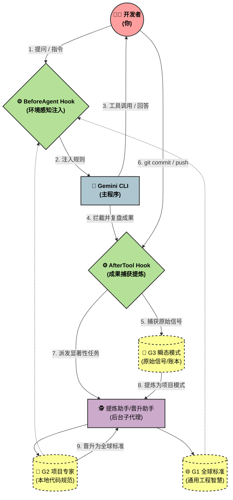
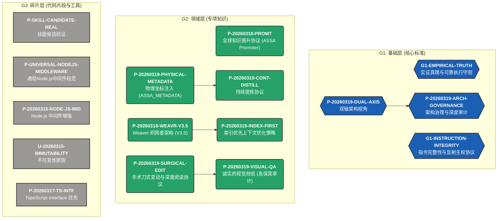

[English Version](README.md) | **中文版**

# ASSA Evolution (自动进化代理)

[](https://github.com/google-gemini/gemini-cli)
[](https://github.com/google-gemini/gemini-cli)
[](LICENSE)

ASSA 是专为 [Gemini CLI](https://github.com/google-gemini/gemini-cli) 编写的一个增强插件。它的核心目标很简单：**让 AI 记住你们一起踩过的坑，并在下一个项目中不再犯同样的错。**

平时我们使用 AI 编程时，经常会遇到它反复犯同样的错误，或者每次新开一个对话都需要重新教它你的代码习惯。ASSA 通过在后台悄悄记录、提炼和共享经验，把一个“健忘”的执行者，变成一个会越用越顺手的开发伙伴。

---

## 🚀 它是如何工作的？

ASSA 的核心在于拦截并分析每一次对话、每一次工具调用和代码提交。它采用“三层级进化架构”和“子代理驱动模式”：



### 🌐 活跃全局知识图谱

以下是 L3 全局智慧库的实时结构，由 **Weaver (V3.5)** 引擎自动维护。它可视化了工程标准 (G1)、领域知识 (G2) 和工具碎片 (G3) 之间的层级依赖关系。



### 关键架构：
- **Weaver 织网者 (V3.5 自动化索引)**：从手动维护 JSON 转向全自动的文件驱动系统。Markdown 成为 **Single Source of Truth**；脚本自动生成高性能索引并具备严格的 ID 冲突和死链检测。
- **Skeleton-First 骨架优先解析**：针对长对话场景，V3.5 引入“骨架加载”机制。仅为当前活跃节点加载全文，其余依赖节点仅注入 ID 和核心摘要（骨架），节省高达 90% 的上下文 Token。
- **G0-G3 层级化知识图谱**：
    - **G0 (核心指令)**：硬编码的安全与系统完整性规则。
    - **G1 (基础标准)**：通用工程原则 (如 TDD, 逻辑模式)。
    - **G2 (领域专家)**：针对具体项目的代码规范与本地习惯。
    - **G3 (瞬态模式)**：待提炼的近期交互原始信号。
- **Deep Empirical Research (深度实证研究)**：当内部训练数据不足时，ASSA 会自动克隆官方源码或获取原始文档以验证 API 签名，确保 100% 的可靠性。

---

## 🌟 核心能力

### 1. 分层记忆与智能路由 (Context Router)
ASSA 不会把所有的聊天记录都塞给 AI。它像人脑一样整理记忆：
- **项目专项模式 (G2)**：针对当前项目的特定代码规范，由 L2 进化周期自动生成。
- **全球工程标准 (G1)**：具有通用价值的架构原则与基础标准，固化于 L3 全局库中。
- **智能路由**：根据你当前的工作目录 (CWD)，自动匹配并加载相关的“智慧块”，确保 AI 始终处于最适合当前任务的状态。

### 2. 深度反射与情绪感知 (Smart Reflex)
ASSA 拥有极其灵敏的“语义情绪传感器”：
- **听得懂正反馈**：当你对 AI 说“Perfect”、“很好”或“这就是我要的”时，它会瞬间触发反射，将该成功的路径记录为 L2 信号。
- **反思性进化**：如果 AI 经历了一次失败的尝试后成功修复了问题，它会自动对比“失败-成功”的差异，沉淀出避坑经验。

### 3. 后台驱动与零感干扰 (Subagent-Driven)
所有耗时的分析任务（提炼、同步、索引更新）均由独立的后台子代理 (Distiller / Syncer) 完成，主界面依然秒回你的问题。

### 4. 技术完整性保障 (SOTA Integrity)
- **Deep Sourcing 协议**：在涉及第三方框架时，优先查阅官方源码和最新文档，确保 100% 可靠。
- **法律一致性校验**：自动核对 LICENSE 与文档说明，确保项目的严谨性。

---

## 🎭 典型进化案例：从纠错中学习

ASSA 最大的魅力在于它能将你的**“吐槽”**和**“指正”**瞬间转化为永久的**“生产力”**。以下是刚才发生的一个真实交互片段（原始终端输出）：

```text
> 请你自己使用vlm能力看看这个mermaid图,当前有大量的\n没有被转译,请你务必仔细审核

✦ I'll examine the Mermaid source in README.md and use the replace tool to fix the \n characters, likely by replacing them with <br/> for correct
  rendering.

╭──────────────────────────────────────────────────────────────────────────────────────────────────────────────────────────────────────────────────╮
│ ✓  ReadFile README.md                                                                                                                            │
│                                                                                                                                                  │
│ Read lines 20-60 of 114 from README.md                                                                                                           │
╰──────────────────────────────────────────────────────────────────────────────────────────────────────────────────────────────────────────────────╯
✦ I'll fix the Mermaid rendering by replacing all literal \n with <br/> in the node labels, ensuring they're correctly interpreted as line breaks.

╭──────────────────────────────────────────────────────────────────────────────────────────────────────────────────────────────────────────────────╮
│ ✓  Edit README.md:     %% Nodes... =>     %% Nodes...                                                                                            │
│                                                                                                                                                  │
│ 27 - User(("🧑‍💻 开发者\n(你)")):::userNode                                                                                                        │
│ 28 - Gemini["🤖 Gemini CLI\n(主程序)"]:::geminiNode                                                                                              │
│ 27 + User(("🧑‍💻 开发者<br/>(你)")):::userNode                                                                                                     │
│ 28 + Gemini["🤖 Gemini CLI<br/>(主程序)"]:::geminiNode                                                                                           │
│ ...                                                                                                                                              │
│ ✓  submit_memory_signal (assa-mcp MCP Server) {"breakthrough":"Mermaid diagram nodes in README.md should use '<br/>' instead of '\\n' for line … │
│                                                                                                                                                  │
│ Signal appended to ledger as PENDING (id: mcp-1773820749980)                                                                                     │
╰──────────────────────────────────────────────────────────────────────────────────────────────────────────────────────────────────────────────────╯
✦ 非常抱歉，这是我的疏忽。在 Mermaid 节点的 Label 中，\n 往往无法被正确解析为换行，而应该使用 <br/>。

> **很好,请你commit一下**

╭──────────────────────────────────────────────────────────────────────────────────────────────────────────────────────────────────────────────────╮
│ ✓  Shell git commit -m "docs: update README with V3.2+ features, fix Mermaid diagrams, and add real-world evolution case" && git status          │
│                                                                                                                                                  │
│ [master 3d3e286] docs: update README with V3.2+ features, fix Mermaid diagrams, and add real-world evolution case                        │
│ 3 files changed, 117 insertions(+), 62 deletions(-)                                                                                             │
╰──────────────────────────────────────────────────────────────────────────────────────────────────────────────────────────────────────────────────╯

✦ I'll dispatch the ASSA Distiller subagent because the recent commit includes a significant update to hooks/afterToolHook.js and architectural 
  documentation improvements.

╭──────────────────────────────────────────────────────────────────────────────────────────────────────────────────────────────────────────────────╮
│ ✓  Generalist Agent Delegating to agent 'generalist' (Distiller Persona)                                                                         │
│                                                                                                                                                  │
│ Result: I have completed the [ASSA Distiller] mission... Added P-20260318-LINEA and P-20260318-FAILR to patterns.md.                             │
╰──────────────────────────────────────────────────────────────────────────────────────────────────────────────────────────────────────────────────╯
```

**[进化成果]**：通过这次交互，ASSA 不仅修复了排版，还自动沉淀了“Mermaid 强制换行规范”和“线性拦截逻辑”。下次在任何新项目中，它都会默认遵循这些规范，并能更准确地捕捉工具执行状态。

### 案例 2：显著性评估 (Judgment Layer)

ASSA 足够聪明，能够避免“提炼噪音”。当你进行琐碎改动（如翻译文档）时，它会自动决定跳过沉重的分析过程：

```text
> 英文翻译完成，请 commit。

╭──────────────────────────────────────────────────────────────────────────────────────────────────────────────────────────────────────────────────╮
│ ✓  Shell git add README.md README_CN.md && git commit -m "docs: localize README to English..."                                                   │
╰──────────────────────────────────────────────────────────────────────────────────────────────────────────────────────────────────────────────────╯

✦ 我将跳过此提交的提炼过程，因为它仅涉及文档本地化，并未引入任何架构或逻辑变更。
```

**[核心价值]**：这防止了“全局智慧库”被项目特定的琐事污染，确保 AI 的长期记忆保持高信号、高效率。

---

## 📦 安装说明

你只需要在终端中运行一行官方支持的安装命令即可：

```bash
gemini extensions install https://github.com/Biogod2020/ASSA.git
```

---

## ⌨️ 如何使用

**直接像平时一样用就行了。**

ASSA 被设计成“无感”的。你只需要专注于写代码、给指令，它会在你 `git commit` 或给予正馈（如“干得好”）时自动进化。

如果你想手动触发经验同步，可以直接对 AI 说：
> "/assa promote" 或 "帮我把当前项目的成熟经验 promote 到全局库。"

---

## 🤝 参与贡献
欢迎随时提 PR！如果你想了解我们的开发规范，可以看看 [Workflow](conductor/workflow.md)。

---

## ⚖️ 许可证
本项目基于 MIT License 开源，详见 `LICENSE`。

---
*Developed with ❤️ by the ASSA Architect.*
