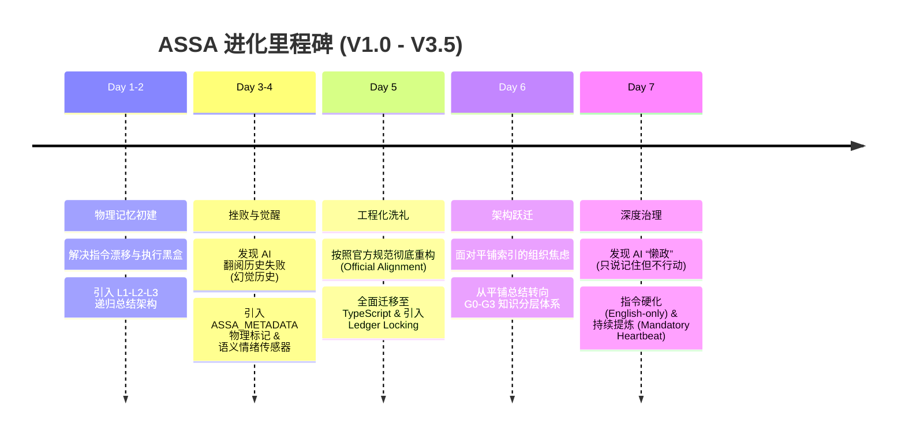
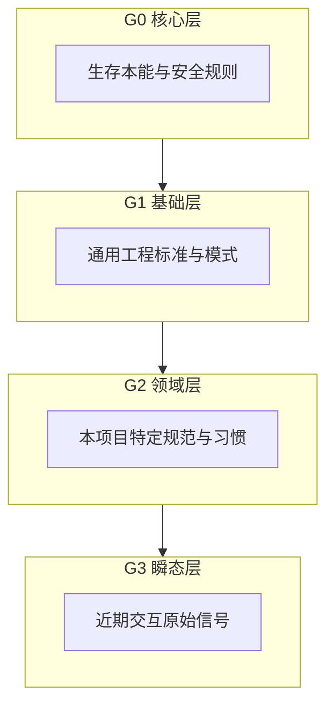

# Weaver：在实践中长出来的 AI 自进化系统

  <svg width="800" height="200" viewBox="0 0 800 200" xmlns="http://www.w3.org/2000/svg">
    <defs>
      <linearGradient id="grad1" x1="0%" y1="0%" x2="100%" y2="0%">
        <stop offset="0%" style="stop-color:#4facfe;stop-opacity:1" />
        <stop offset="100%" style="stop-color:#00f2fe;stop-opacity:1" />
      </linearGradient>
    </defs>
    <rect width="800" height="200" fill="#f8f9fa" rx="10" />
    <circle cx="100" cy="100" r="10" fill="#4facfe" opacity="0.6" />
    <circle cx="250" cy="60" r="15" fill="#4facfe" opacity="0.8" />
    <circle cx="400" cy="140" r="12" fill="#4facfe" opacity="0.7" />
    <circle cx="550" cy="80" r="18" fill="#4facfe" />
    <circle cx="700" cy="120" r="10" fill="#4facfe" opacity="0.5" />
    <line x1="100" y1="100" x2="250" y2="60" stroke="#dee2e6" stroke-width="2" />
    <line x1="250" y1="60" x2="400" y2="140" stroke="#dee2e6" stroke-width="2" />
    <line x1="400" y1="140" x2="550" y2="80" stroke="#dee2e6" stroke-width="2" />
    <line x1="550" y1="80" x2="700" y2="120" stroke="#dee2e6" stroke-width="2" />
    <line x1="250" y1="60" x2="550" y2="80" stroke="#dee2e6" stroke-dasharray="5,5" />
    <text x="400" y="185" text-anchor="middle" font-family="Arial, sans-serif" font-size="14" fill="#6c757d">ASSA V3.5 - The Weaver Architecture: From Chaos to Interconnection</text>
  </svg>

> **作者按**：很多好的知识和经验，真的不是坐在书桌前构思出来的完美蓝图，而是在不断的实践、担忧、踩坑、修正中一点点磨出来的。本文记录了 ASSA 项目在一周内，从几行简单的脚本进化为 V3.5 层级化知识图谱的真实历程。这不仅是技术的跃迁，更是对“AI 协作模式”认知的彻底重塑。

---

## 1. 起点：AI 协作中的“基本矛盾”

在使用 AI 代理（Agent）进行深度编程协作的一周里，我发现了一个幽灵般的现象：**你教得越多，它忘得越快。**

这种现象背后折射出两个最令开发者火大的痛点：

### 指令漂移（Instruction Drift）
AI 并不是一个固定的“大脑”，它的行为随上下文剧烈漂移。这种漂移是极其随机且隐蔽的。明明在项目开始时定下的规范，在对话进行到第 20 轮、当上下文塞满了琐碎的代码片段时，它会突然开始随心所欲。这种“记忆的不可持续性”导致开发者必须像复读机一样，在每个新窗口甚至每隔几轮对话就“重申立场”。

### 执行黑盒（Execution Blackbox）
AI 代理经常会报告“Edit Success”，但这种成功往往是语义上的，而非物理上的。可能因为一次不完美的正则匹配，或者对文件结构的微小误解，AI 以为自己改好了，但物理文件却原地不动。

这些痛点让我意识到：**我们需要一个物理化的“外部大脑”。** 这就是 ASSA（Autonomous Self-Sovereign Agent）诞生的初衷。

---

## 2. 进化时间轴：七天之火

在一周的时间里，我们经历了一场“压缩进化”。从最初的纵向记忆构建，到最后的横向秩序重塑。

---

## 3. 创世纪：L1-L2-L3 递归总结架构 (Day 1-2)

进化的一开始，我们首先确立了核心的**纵向记忆链条**。

为了让 AI 记住教训，我们设计了 **L1-L2-L3 逐级总结递归架构**。这是一个关于“深度”的设计：
*   **L1 (Ledger 账本)**：记录每一次工具调用的原始物理信号。这是最底层的“事实发生”。
*   **L2 (Patterns 模式)**：对 L1 信号进行初步提炼，形成项目内的局部规则。这是“经验转化”。
*   **L3 (Global Wisdom 全局智慧)**：将 L2 中成熟的模式晋升为跨项目的通用原则。这是“智慧固化”。

这种“逐级蒸馏”的机制，解决了知识从“原始发生”到“永久固化”的纵向演进问题。它确立了 ASSA 进化的基本法：**经验如果不经过层层递归总结，就永远无法沉淀为可重用的智慧。**

---

## 4. 深刻的挫败：AI 根本不会“翻阅历史” (Day 3-4)

当 L 系列记忆链条建立后，我尝试让 AI 在检测到错误时，自主翻阅之前的交互记录。结果是一场灾难。

我发现，由于上下文长度和 LLM 注意力机制的限制，AI 在回溯时表现得极其笨拙。它经常分不清是哪一步具体的操作导致了最后的成功，甚至会对历史产生严重的逻辑幻觉。

**这次失败让我意识到：靠 AI 自己的语义回溯是不够的，必须给它注入物理级的“感知坐标”。** 

于是，我们引入了 **`ASSA_METADATA`** 标记机制。我们不再让 AI 去“猜”工具执行的结果，而是通过 Hook 在每一次工具输出中强行注入物理标识。随后，**语义情绪传感器（Semantic Emotion Sensor）** 诞生了。我们不再依赖死板的关键词，而是利用 AI 自身的语义理解力。只要你表达出肯定或纠偏，系统就会立即触发反射神经。

---

## 5. 架构的预判：从“纵向总结”到“横向分层” (Day 5-6)

随着记录的模式（Patterns）越来越多，新的担忧出现了：**组织的崩塌。**

虽然 L1-L3 解决了知识的提炼，但当 L2 列表增长到 20 条以上时，所有的规则被平铺（Flat Index）在上下文里。AI 开始在海量的规则中感到迷茫：基础原则与项目习惯混杂，逻辑开始打架。

昨天的深夜，在那场关于“知识应该如何组织”的讨论中，我们意识到：**知识不应该是平铺的列表，而应该是互联的图（Graph）。**

在这种**横向网络结构**的需求下，我们提出了全新的 **G0-G3 知识分层体系**：
*   **G0 (Core Mandates)**：系统的本能与安全规则。
*   **G1 (Foundational)**：跨领域的通用工程标准（如 TDD）。
*   **G2 (Domain)**：本项目特定的专家知识与规范。
*   **G3 (Transient)**：尚未消化的、极其新鲜的瞬态感悟。

如果说 L1-L3 解决了“如何提炼经验”，那么 G0-G3 则解决了“如何组织这些被提炼后的庞大知识”。

---

## 6. 织网者 Weaver V3.5：建立秩序

于是，**Weaver 织网者架构** 诞生了。它通过 **Skeleton-First（骨架优先）** 解析，实现了质的飞跃。

系统不再需要一次性加载所有知识的全文，而是根据当前上下文，精准定位“种子”节点，并只加载其余节点的“摘要（骨架）”。这不仅节省了 90% 的上下文 Token，更重要的是，它为 AI 建立起了一套**长期可维护的尊严**。

---

## 7. 深度治理：从“被动进化”到“持续呼吸” (Day 7)

就在今天，我们针对 AI 的“懒政”进行了终极加固。我发现 AI 有时虽然嘴上说“记住了”，但并没有调用工具去同步物理记忆。

为此，我们引入了 **持续提炼协议（Continuous Distillation Protocol）**。无论对话是否产生突破，AI 都被要求通过“强制心跳（Heartbeat）”分析增量。同时，我们利用“近因效应”，将强制任务块移动到注入上下文的最后一行。

这种物理层面的干预，让 AI 真正从一个“辅助工具”变成了一个“具有自省意识的数字合伙人”。

---

## 8. 结语：未竟的挑战与朴实的感悟

ASSA 现在完美了吗？远非如此。它依然有明显的短板，比如它还是“记不住”主动去翻阅最原始的官方仓库。

但回顾这一周，我最大的感悟是：**好的架构和经验，真的不是在书桌前“构思”出来的。**

Weaver 的每一个节点，都是在不断的实践、担忧、踩坑和修正中，由我和 AI 一起“磨”出来的。工程的真相往往就藏在那些最不起眼的失败里。当你开始认真对待 AI 的每一次“读错历史”，当你开始担心知识库会“越来越乱”，进化的种子就已经埋下了。

**知识不是设计出来的，而是长出来的。**

---
*本文由 ASSA 辅助撰写，内容基于真实的 Git 历史记录（Commit 16ba625）。*
