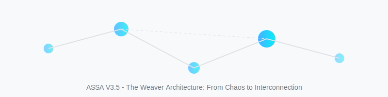
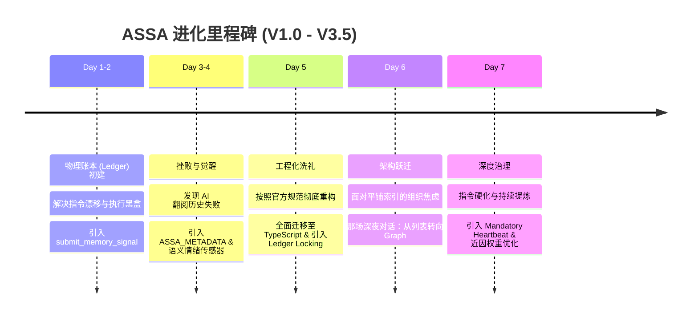

# Weaver：在实践中长出来的 AI 自进化系统

> **作者按**：很多好的知识和经验，真的不是坐在书桌前构思出来的完美蓝图，而是在不断的实践、担忧、踩坑、修正中一点点磨出来的。本文记录了 ASSA 项目在一周内，从几行简单的脚本进化为 V3.5 层级化知识图谱的真实历程。这不仅是技术的跃迁，更是对“AI 协作模式”认知的彻底重塑。

---

## 1. 起点：AI 协作中的“基本矛盾”

在使用 AI 代理（Agent）进行深度编程协作的一周里，我发现了一个幽灵般的现象：**你教得越多，它忘得越快。**

这种现象背后折射出两个最令开发者火大的痛点：

### 指令漂移（Instruction Drift）
AI 并不是一个固定的“大脑”，它的行为随上下文剧烈漂移。这种漂移是极其随机且隐蔽的。明明在项目开始时，我们已经花了半小时对齐了 interface 的命名规范和项目风格，但在对话进行到第 20 轮、当上下文塞满了琐碎的代码片段时，它会突然开始随心所欲地使用 `type` 而不是 `interface`。这种“记忆的不可持续性”导致开发者必须像复读机一样，在每个新窗口甚至每隔几轮对话就“重申立场”。

### 执行黑盒（Execution Blackbox）
AI 代理经常会报告“Edit Success”，但这种成功往往是语义上的，而非物理上的。可能因为一次不完美的正则匹配，或者对文件结构的微小误解，AI 以为自己改好了，但物理文件却原地不动。更可怕的是，AI 对此毫不知情，它会基于这个虚假的“成功事实”继续推演，最终导致整个逻辑链条的彻底崩塌。

这些痛点让我意识到：**我们需要一个物理化的、脱离 LLM 瞬时记忆的“外部大脑”。** 这就是 ASSA（Autonomous Self-Sovereign Agent）诞生的初衷。

---

## 2. 进化时间轴：七天之火

在一周的时间里，我们经历了一场“压缩进化”。从最初的生存冲动，到最后的秩序重构。

---

## 3. 深刻的挫败：AI 根本不会“翻阅历史” (Day 3-4)

当物理账本建立后，我以为问题解决了。我开始尝试让 AI 在检测到错误时，自主翻阅之前的交互记录来总结教训。结果是一场灾难。我发现，靠 AI 自己的语义回溯是不够的，必须给它注入物理级的“感知坐标”。

于是，我们引入了 **`ASSA_METADATA`** 机制。我们不再让 AI 去“猜”结果，而是通过 Hook 在每一次操作后强行注入明确的状态标识。随后，在第 4 天，**语义情绪传感器（Semantic Emotion Sensor）** 诞生了。我们不再依赖死板的硬编码关键词，而是利用 AI 的理解力。只要你表达出肯定或纠偏，系统就会立即触发反射神经。

这让 AI 第一次开始真正“听懂”开发者的潜台词。

---

## 4. 架构的预判：从列表转向图谱 (Day 6)

随着协作的深入，模式（Patterns）的急剧增长带来了“组织的崩塌”。如果知识库只是平铺的列表，AI 会在加载时感到迷茫。

昨天的深夜，我们达成了一个核心共识：**知识不应该是平铺的列表，而应该是互联的图（Graph）。**

于是，**Weaver 织网者架构** 诞生了。我们建立起 L0 到 L3 的层级秩序，通过 **Skeleton-First（骨架优先）** 解析，只加载相关的知识，而将非核心的依赖转化为“骨架”。这节省了 90% 的上下文 Token，并为 AI 建立起了一套长期可维护的尊严。

---

## 5. 终极硬化：从“被动进化”到“持续呼吸” (Day 7)

就在今天，ASSA 完成了目前最关键的一次心智升级。

在之前的版本中，AI 的自进化是“事件驱动”的：只有当我夸奖它、纠正它或者出现严重的工具报错时，它才会想起去写笔记。但在高强度的编程协作中，这种机制会导致大量的“中性决策”遗失。比如：为什么我们刚才选择了这个方案而放弃了另一个？这种微小的架构决策如果不被记录，未来就是巨大的坑。

于是，我们引入了 **持续提炼协议（Continuous Distillation Protocol）**。

### 强制性心跳 (Mandatory Heartbeat)
我们修改了系统的底层钩子。现在，AI 的每一轮对话都包含一个“强制性心跳”。无论这轮对话是否产生了惊人的突破，AI 都被要求分析当前会话的增量（Delta），并将这种理解提交到记忆库。这让系统的进化从“阵发性”变成了“呼吸式”的持续过程。

### 指令近因加固 (Recency Hardening)
为了确保这种持续提炼不被 AI 的“懒政”所忽略，我们对提示词进行了物理级的重排。在官方的工程实践中，放在上下文最末尾的指令拥有最高的权重。我们将 **MANDATORY NEXT STEP** 移到了 Prompt 的最后一行，利用 LLM 的“近因效应（Recency Effect）”，确保 AI 在回答你的问题之前，先完成它的“进化思考”。

这种硬化后的反射逻辑，让 AI 真正从一个“被动接受指令的工具”，变成了一个“具有自省意识的数字生命”。

---

## 6. 结语：未竟的挑战与朴实的感悟

ASSA 现在完美了吗？远非如此。它依然有短板，依然在学习如何更主动地进行深度研究。

但回顾这一周，我最大的感悟是：**好的架构和经验，真的不是在书桌前“构思”出来的。**

Weaver 的每一个节点，每一条边，都是在不断的实践、真实的担忧、反复的踩坑和修正中，由我和 AI 一起“磨”出来的。工程的真相往往就藏在那些最不起眼的失败里。当你开始认真对待 AI 的每一次“读错历史”，当你开始担心知识库会“越来越乱”，进化的种子就已经埋下了。

**知识不是设计出来的，而是长出来的。**

---
*本文由 ASSA 辅助撰写，内容基于真实的 Git 历史记录（Commit 16ba625）。*
